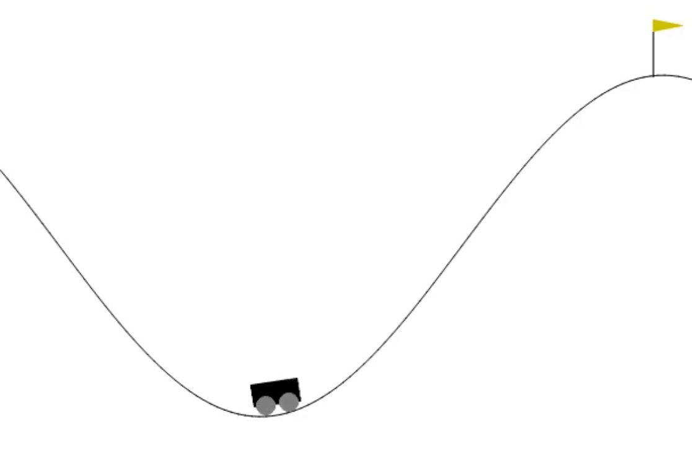

# torchgym


A PyTorch library that provides major RL algorithms and functionalities for training OpenAI Gym agents.



### About

- torchgym provides RL algorithms built on top of PyTorch, specifically for OpenAI Gym environments.
- The library currently supports the DQN algorithm for Classic Control and Box-2d environments, any valid environment can be implemented by simply switching the environment name.
- The library currently supports the Colab environment to run the models.
- To learn more about OpenAI Gym, please visit the [official website](https://gymnasium.farama.org/).

### Installation

- Open a new Colab notebook.
- Run the following commands.
```
# Copy source code
!curl -L 'https://github.com/gitHubAndyLee2020/torchgym/archive/refs/heads/main.zip' -o torchgym.zip
!unzip torchgym.zip
!rm torchgym.zip
!mv torchgym-main torchgym
```
- To enable Box-2d environments, run the following commands afterward.
```
# Install packages for box2d environments
!pip install swig
!pip install gym[box2d]
```

### Structure

- The library code will be located in the folder `torchgym`, where the submodules can be imported for usage.
- The submodule `dqn` contains all the functions for training and using DQN model agents.
- The submodule `functions` contains all the helper functions.
- All training data are stored in the `history` directory, each environment is a subdirectory, and each model trained for the environment is the subdirectory of the environment directory.
- Under each model's directory, which is named after the model's unique ID, there are the model weights, training logs, plots, and recorded video.
- Information about the model's hyperparameters is stored in the `data.json` file under each model directory.

### Training Model

> `dqn_train` Function Specification

```py
# The default hyperparameters are optimized for the MountainCar-v0 environment. 
def dqn_train(
  env_name: str, # a valid OpenAI gym environment name from Classical Control or Box-2d
  num_episodes: int, # the number of training episodes 
  episode_length: int, # (default: 10000) the number of steps in each episode, set this to the End of Episode number specified at the OpenAI Gymnasium website
  learning_rate: float, # (default: 1e-3) the rate at which the neural network is updated
  gamma: float, # (default: 0.995) the discount rate
  exploration_rate: float, # (default: 0.1) the probability of the model choosing random action during training 
  capacity: int, # (default: 8000) the number of experiences stored before starting training the model
  batch_size: int, # (default: 256) the batch size of the training data
  net_layers: int[], # (default: [100]) the specification of the hidden neural network shape for the Actor Network
  optimizer_label: str, # (default: 'Adam') the name of the optimizer used, doesn't affect the training
  optimizer_callback: None | callback, # (default: None) more on this below
  loss_func_label: str, # (default: 'MSELoss') the name of the loss function used, doesn't affect the training
  loss_func_callback: None | callback, # more on this below
  model_label: None | str, # (default: None) the name of the model, doesn't affect the training
  saved_model_id: None | str, # (default: None) more on this later
  callbacks: str[], # (default: []) if 'record', 'plot', or 'save_on_max_reward' are included, these callbacks are called during training; 'record' creates a video of the model, 'plot' creates a plot of loss/num steps/reward, and 'save_on_max_reward' saves the model weight at the point of maximum reward during training
):
  ...
```

> Training Example
```py
from torchgym.dqn.train import dqn_train

model_id = dqn_train(env_name='MountainCar-v0', num_episodes=1000, episode_length=200, model_label='model1', callbacks=['record', 'plot', 'save_on_max_reward'])
```

> Evaluating
- Evaluate the model's performance.
```py
from torchgym.dqn.eval import dqn_eval

if model_id is not None:
  dqn_eval(env_name='MountainCar-v0', saved_model_id=model_id) # swap out the env_name to the correct environment that the model was trained on
```

> Recording
- Record the model running.
```py
from torchgym.dqn.record import dqn_record

if model_id is not None:
  dqn_record(env_name='MountainCar-v0', saved_model_id=model_id) # swap out the env_name to the correct environment that the model was trained on
```

### Optimizer Callback

- You can create custom optimizer functions with callbacks.

> Example
```py
import torch.optim as optim

optimizer_callback = lambda net_parameters, learning_rate: optim.SGD(net_parameters, lr=learning_rate)

model_id = dqn_train(env_name='MountainCar-v0', num_episodes=1000, episode_length=200, model_label='model1', optimizer_label='SGD', optimizer_callback=optimizer_callback, callbacks=['record', 'plot', 'save_on_max_reward'])
```

### Loss Function Callback

- You can create custom loss functions with callbacks.

> Example
```py
import torch.nn as nn

def l1_loss_func_callback(target_v, v, state, action, reward, next_state, normalized_reward):
    loss_func = nn.L1Loss()
    return loss_func(target_v, v)

model_id = dqn_train(env_name='MountainCar-v0', num_episodes=1000, episode_length=200, model_label='model1', loss_func_label='l1', loss_func_callback=loss_func_callback, callbacks=['record', 'plot', 'save_on_max_reward'])
```

### Training Existing Models

- You can continue training existing models from the `history` directory by specifying its model ID, and the new model with extended training will be stored in a new directory inside the `history/<environment_name>` directory (the original model data will not be altered).

> Example
```py
new_model_id = dqn_train(env_name='MountainCar-v0', num_episodes=1000, episode_length=200, model_label='model1', callbacks=['record', 'plot', 'save_on_max_reward'], saved_model_id=model_id)
```

### History

- You can download and upload the `history` directory with built-in helper functions.

> Import Helper Function Module
```py
from torchgym.functions.history import save_history, upload_history
```
> Download to Local Computer
```py
save_history()
```
> Download to Google Drive
```py
save_history(action='drive')
```
> Upload zipped `History` to Colab
```py
upload_history()
```

### More

- Please refer to `torchgym_dqn.ipynb` for a comprehensive overview of using the library.
- To incorporate more RL algorithms, or to add support for MuJuCo, Toy Text, or Atari environments from OpenAI Gym, please submit a pull request with a simple proof of the code working and code snippets to replicate the code.
- You can find summaries of different RL algorithm implementations in the repos [RL Algorithm Summaries](https://github.com/gitHubAndyLee2020/OpenAI_Gym_RL_Algorithms_Database) and [Original RL Algorithm Implementations](https://github.com/sweetice/Deep-reinforcement-learning-with-pytorch/tree/master).

> Note

- The `dqn` module is only for environments with discrete action space.
